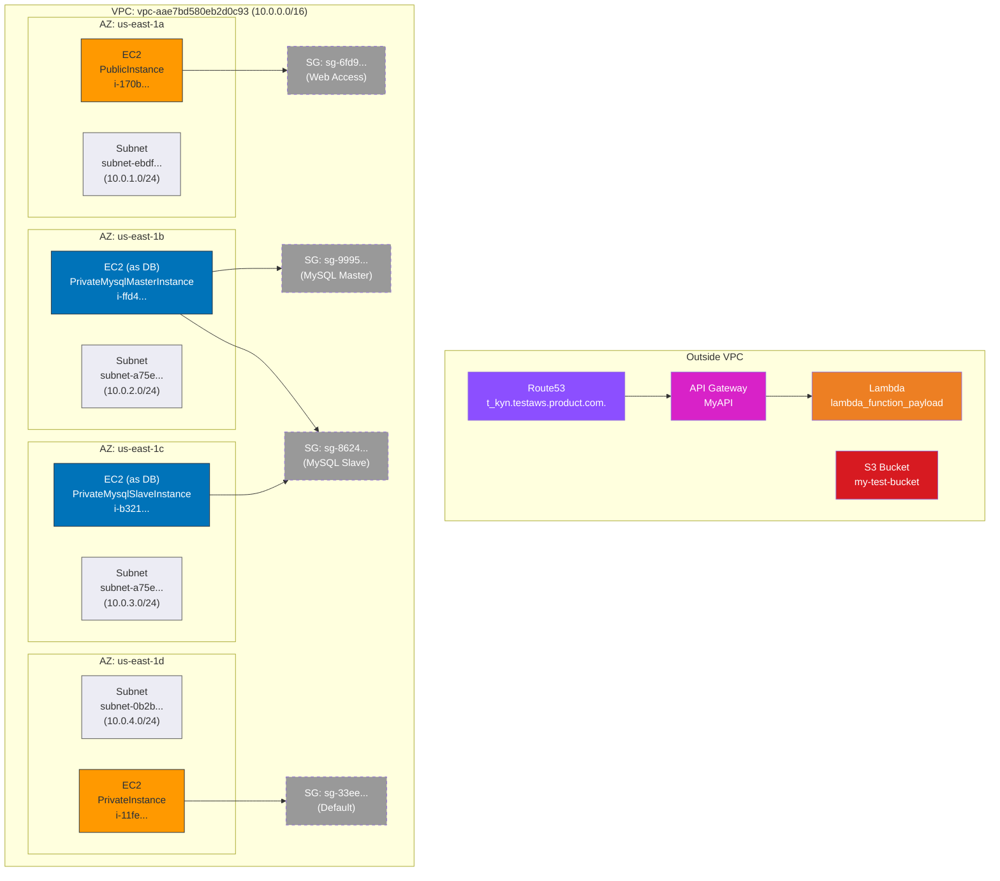

```mermaid
graph TD
    %% --- スタイル定義 ---
    classDef vpc fill:#f9f9f9,stroke:#333,stroke-width:2px;
    classDef subnet fill:#ECECF4,stroke:#555;
    classDef ec2 fill:#FF9900,stroke:#232F3E,color:#232F3E;
    classDef rds fill:#0073B9,stroke:#232F3E,color:#fff;
    classDef s3 fill:#D71A21,color:#fff;
    classDef lambda fill:#ED7F23,color:#fff;
    classDef apigw fill:#D822C8,color:#fff;
    classDef route53 fill:#8C4FFF,color:#fff;
    classDef sg fill:#999,stroke-dasharray: 5 5,color:#fff;

    %% --- VPC外のリソース ---
    subgraph "Outside VPC"
        R53["Route53<br>t_kyn.testaws.product.com."];
        APIGW["API Gateway<br>MyAPI"];
        Lambda["Lambda<br>lambda_function_payload"];
        S3["S3 Bucket<br>my-test-bucket"];
    end

    %% --- メインVPCと内部リソース ---
    subgraph "VPC: vpc-aae7bd580eb2d0c93 (10.0.0.0/16)"
        direction LR

        %% --- セキュリティグループ定義 ---
        sg_public["SG: sg-6fd9...<br>(Web Access)"];
        sg_mysql_master["SG: sg-9995...<br>(MySQL Master)"];
        sg_mysql_slave["SG: sg-8624...<br>(MySQL Slave)"];
        sg_private["SG: sg-33ee...<br>(Default)"];
        class sg_public,sg_mysql_master,sg_mysql_slave,sg_private sg;

        subgraph "AZ: us-east-1a"
            sub1["Subnet<br>subnet-ebdf...<br>(10.0.1.0/24)"];
            ec2_public["EC2<br>PublicInstance<br>i-170b..."];
        end

        subgraph "AZ: us-east-1b"
            sub2["Subnet<br>subnet-a75e...<br>(10.0.2.0/24)"];
            ec2_master_db["EC2 (as DB)<br>PrivateMysqlMasterInstance<br>i-ffd4..."];
        end
        
        subgraph "AZ: us-east-1c"
            sub3["Subnet<br>subnet-a75e...<br>(10.0.3.0/24)"];
            ec2_slave_db["EC2 (as DB)<br>PrivateMysqlSlaveInstance<br>i-b321..."];
        end
        
        subgraph "AZ: us-east-1d"
            sub4["Subnet<br>subnet-0b2b...<br>(10.0.4.0/24)"];
            ec2_private["EC2<br>PrivateInstance<br>i-11fe..."];
        end

    end

    %% --- 関連性の定義 ---
    R53 --> APIGW;
    APIGW --> Lambda;
    
    ec2_public --> sg_public;
    ec2_master_db --> sg_mysql_master;
    ec2_master_db --> sg_mysql_slave;
    ec2_slave_db --> sg_mysql_slave;
    ec2_private --> sg_private;
    
    %% --- クラス適用 ---
    class R53 route53;
    class APIGW apigw;
    class Lambda lambda;
    class S3 s3;
    class ec2_public,ec2_private ec2;
    class ec2_master_db,ec2_slave_db rds;
    class sub1,sub2,sub3,sub4 subnet;
```